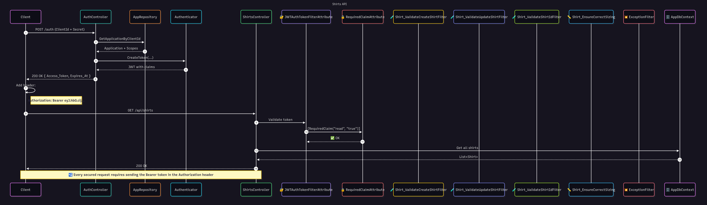
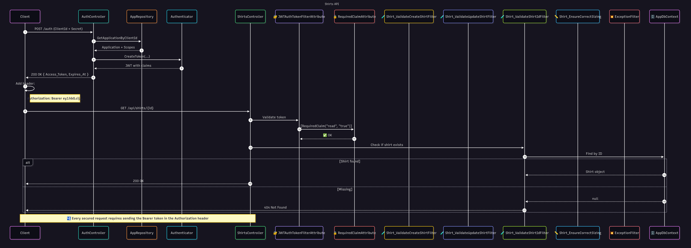
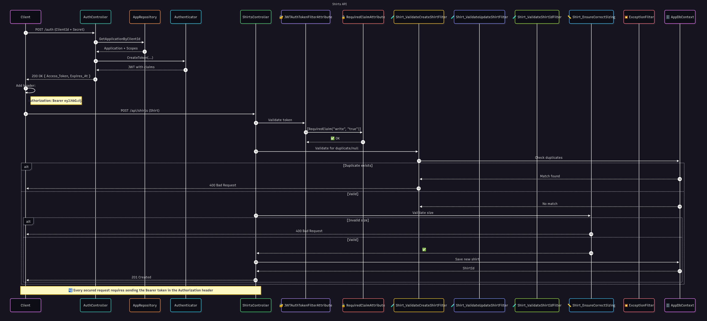
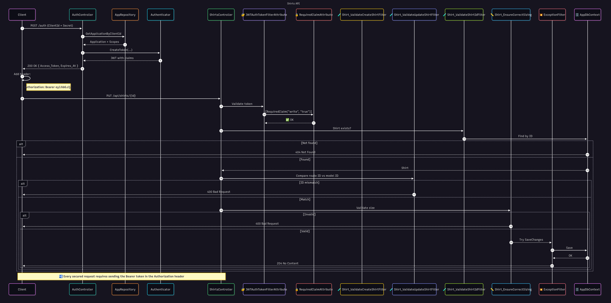
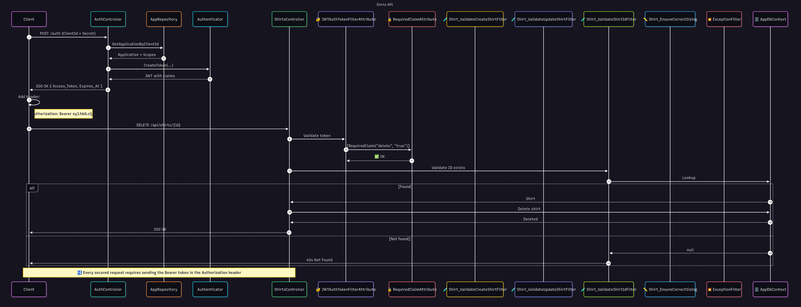

# 👕 Shirts API — Full Project Documentation
Welcome! This guide explains **how to build a secure, validated, and production-ready ASP.NET Core Web API** using the Shirts API as a hands-on example. It's designed for students who want to master:

- ✅ Model validation with data annotations and custom attributes
- ✅ Security using JWT bearer tokens and claim-based permissions
- ✅ Filter pipelines that validate, authorize, and gracefully handle errors
- ✅ Clean controller logic and scalable project design

Let’s begin 🚀

## 🗂️ **Project Folder Structure**

Here’s the recommended layout for the Shirts API project:

```
ShirtsApi/
│
├── Attributes/
│   └── RequiredClaimAttribute.cs				# Declarative claim contract
│
├── Authority/
│   ├── AppCredential.cs					# Represents client-provided Id/secret
│   ├── Application.cs						# Static configuration model for client identity
│   ├── AppRepository.cs					# Performs credential validation logic
│   └── Authenticator.cs					# Handles JWT creation and verification
│
├── Controllers/
│   ├── ShirtsController.cs					# Main CRUD controller
│   └── AuthorityController.cs					# Issues JWT tokens
│
├── Data/
│   └── AppDbContext.cs						# EF Core context setup
│
├── Filters/
│   ├── ActionFilters/
│   │   ├── Shirt_ValidateCreateShirtFilterAttribute.cs
│   │   ├── Shirt_ValidateUpdateShirtFilterAttribute.cs
│   │   └── Shirt_ValidateShirtIdFilterAttribute.cs
│   │
│   ├── AuthFilters/
│   │   └── JWTAuthTokenFilterAttribute.cs
│   │
│   └── ExceptionFilters/
│       └── Shirt_HandleUpdateExceptionFilterAttribute.cs
│
├── Models/
│   └── Shirt.cs						# Domain model with validation
│
├── Validations/
│   └── Shirt_EnsureCorrectSizingAttribute.cs			# Custom business rule
│
├── Program.cs							# App startup entry
├── appsettings.json						# Configuration file
```

🧠 **What This Teaches**

- **Separation of concerns**: Each folder has a focused responsibility.
- **Discoverability**: Students can find validation logic, filters, or models without digging through unrelated files.
- **Scalability**: As new features are added (e.g., products, orders), this structure can easily grow.

## 📦 **Project Goals & Architecture**

- **Goal**: Build an API to manage shirt records (Create, Read, Update, Delete)
- **Security**: Use JWT bearer tokens to protect write/update/delete endpoints
- **Validation**: Apply business rules like shirt sizing using attributes and filters
- **Organization**: Use ASP.NET Core Filters to separate logic and improve readability
- **Client**: Designed to be consumed by any frontend (e.g., MVC, React, etc.)

## 🛠️ **AppSettings Configuration**

The `appsettings.json` file is essential for storing environment-specific configuration such as database connection strings and security keys. In the Shirts API, it provides the connection details for the SQL Server database and the symmetric key used for signing JWT tokens. Make sure to keep your `SecurityKey` value secret and never commit sensitive keys to public repositories.

```json

{
	"ConnectionStrings": {
		"DefaultConnection": "Data Source=(localdb)\\MSSQLLocalDB;Initial Catalog=ShirtStore;Integrated Security=True;TrustServerCertificate=True;MultipleActiveResultSets=True"
	},
	"SecurityKey": "kkkkkkkkkkkkkkkkkkkkkkkkkkkkkkkk"
}
```
## ⚙️ Dependency Injection & Middleware Setup

ASP.NET Core uses built-in dependency injection (IoC) and a configurable middleware pipeline to manage services and handle HTTP requests. Here’s how the Shirts API wires up its dependencies and middleware in `Program.cs`:

```csharp
var builder = WebApplication.CreateBuilder(args);

// Add services to the container.
builder.Services.AddDbContext<AppDbContext>(options =>
{
    options.UseSqlServer(builder.Configuration.GetConnectionString("DefaultConnection"));
});

builder.Services
    .AddControllers()
    .AddJsonOptions(options =>
    {
	// Configure JSON serializer to ignore null values during serialization
	options.JsonSerializerOptions.DefaultIgnoreCondition = JsonIgnoreCondition.WhenWritingNull;
	// Configure JSON serializer to use Pascal case for property names during serialization
	options.JsonSerializerOptions.PropertyNamingPolicy = null;
	// Configure JSON serializer to use Pascal case for key's name during serialization
	options.JsonSerializerOptions.DictionaryKeyPolicy = null;
	// Ensure JSON property names are not case-sensitive during deserialization
	options.JsonSerializerOptions.PropertyNameCaseInsensitive = true;
	// Prevent serialization issues caused by cyclic relationships in EF Core entities
	options.JsonSerializerOptions.ReferenceHandler = ReferenceHandler.IgnoreCycles;
	// Ensure the JSON output is consistently formatted for readability.
	// Not to be used in Production as the response message size could be large.
	// options.JsonSerializerOptions.WriteIndented = true;
    });

builder.Services.AddOpenApi();

var app = builder.Build();

// Configure the HTTP request pipeline.

if (app.Environment.IsDevelopment())
    app.MapOpenApi();

app.UseHttpsRedirection();

app.MapControllers();

app.Run();
```

**Note**:

- The database context (`AppDbContext`) is registered for dependency injection.
- Controllers are configured with custom JSON options for casing and reference handling.
- Some filters in this project (such as `Shirt_ValidateCreateShirtFilterAttribute`, `Shirt_ValidateShirtIdFilterAttribute`, and `Shirt_HandleUpdateExceptionFilterAttribute`) require services like `AppDbContext` via constructor injection.
- To enable this, these filters are applied using `[TypeFilter(typeof(...))]` in your controllers, which allows ASP.NET Core to resolve their dependencies from the IoC container at runtime.
- **You do not need to register these attribute classes in the IoC container manually**—ASP.NET Core handles this automatically when you use `TypeFilter`.
- Attribute-based filters that do **not** require DI (i.e., have parameterless constructors) can be applied directly without `TypeFilter`.
- Middleware like HTTPS redirection and controller mapping is set up in the correct order.

## 🔐 **Token-Based Authentication**

### ✅ AppCredential.cs

```csharp
public sealed class AppCredential
{
	public string ClientId { get; set; } = string.Empty;
	public string Secret { get; set; } = string.Empty;
}
```

🧠 **Purpose**: This model is posted from the frontend to authenticate with the Authority API. It acts like a "client username/password."

### ✅ Application.cs

```csharp
public sealed class Application
{
	public int ApplicationId { get; set; }
	public string? ApplicationName { get; set; }
	public string? ClientId { get; set; }
	public string? Secret { get; set; }
	public string? Scopes { get; set; }
}
```

🧠 **Purpose**: Represents a registered application in your system. This model defines which clients are allowed to request tokens and what scopes (permissions) they’re granted. It’s essentially an identity + permission contract for third-party or frontend apps.

### ✅ AppRepository.cs

```csharp
public static class AppRepository
{
	private static readonly List<Application> _applications = [
		new Application
		{
			ApplicationId = 1,
			ApplicationName = "MVCWebApp",
			ClientId = "53D3C1E6-3F0B-4A1C-8D2B-5E6F7A8B9C0D",
			Secret = "0673FC70-3B4C-5D6E-7F8G-9H0I1J2K3L4M",
			Scopes = "read,write,delete"
		}
	];

	public static Application? GetApplicationByClientId (string clientId)
	{
		return _applications.FirstOrDefault (app => app.ClientId == clientId);
	}
}
```

🧠 **Purpose**: This static repository stores all trusted client applications that are allowed to request access tokens. Instead of loading credentials from config or a database, it keeps an in-memory list of known apps.

When a client requests a token (e.g., through /auth endpoint), the API can use AppRepository.GetApplicationByClientId(...) to verify:

- Does the client exist?
- Is the secret valid?
- What scopes/permissions should be assigned to the token?

### ✅ Authenticator.cs

```csharp
public static class Authenticator
{
	public static bool Authenticate (string clientId, string secret)
	{
		var app = AppRepository.GetApplicationByClientId (clientId);

		if (app is null)
			return false;

		return (app.ClientId == clientId && app.Secret == secret);
	}

	public static string CreateToken (string clientId, DateTime expiresAt, string secretKey)
	{
		// Signing Key - can be a secret or a private key.

		// Algorithm - to create a token based on the clientId.
		var signingCredentials = new SigningCredentials (
			new SymmetricSecurityKey (Encoding.UTF8.GetBytes (secretKey)),
			SecurityAlgorithms.HmacSha256);

		// Payload - can include claims, expiration, etc.
		var app = AppRepository.GetApplicationByClientId (clientId);

		var claimsDictionary = new Dictionary<string, object>
		{
			{ "AppName", app?.ApplicationName ?? string.Empty },
		};

		var scopes = app?.Scopes?.Split (",") ?? [];

		if (scopes.Length > 0)
		{
			foreach (var scope in scopes)
			{
				claimsDictionary[scope.Trim ().ToLower ()] = "true";
			}
		}

		var tokenDescriptor = new SecurityTokenDescriptor
		{
			SigningCredentials = signingCredentials,
			Claims = claimsDictionary,
			Expires = expiresAt,
			NotBefore = DateTime.Now,
		};

		var tokenHandler = new JsonWebTokenHandler ();

		return tokenHandler.CreateToken (tokenDescriptor);
	}

	public static async Task<IEnumerable<Claim>?> VerifyTokenAsync (string token, string secretKey)
	{
		if (string.IsNullOrEmpty (token) || string.IsNullOrEmpty (secretKey))
			return null;

		var keyBytes = Encoding.UTF8.GetBytes (secretKey);
		var tokenHandler = new JsonWebTokenHandler ();

		var validationParameters = new TokenValidationParameters
		{
			ValidateIssuerSigningKey = true,
			IssuerSigningKey = new SymmetricSecurityKey (keyBytes),
			ValidateIssuer = false,
			ValidateAudience = false,
			ValidateLifetime = true,
			ClockSkew = TimeSpan.Zero // No clock skew for simplicity
		};

		try
		{
			var result = await tokenHandler.ValidateTokenAsync (token, validationParameters);

			if (result.SecurityToken is not null)
			{
				var tokenObject = tokenHandler.ReadJsonWebToken (token);
				return tokenObject.Claims ?? [];
			}
			else
			{
				return null;
			}
		}
		catch (SecurityTokenMalformedException)
		{
			return null;
		}
		catch (SecurityTokenExpiredException)
		{
			return null;
		}
		catch (SecurityTokenInvalidSignatureException)
		{
			return null;
		}
		catch (SecurityTokenValidationException)
		{
			return null;
		}
		catch (Exception)
		{
			throw;
		}
	}
}
```
🧠 **What This Class Does**

| Method			| Purpose																|
|-------------------|-----------------------------------------------------------------------|
| Authenticate		| Validates a client Id and secret against stored applications			|
| CreateToken		| Generates a JWT with dynamic claims based on the app's allowed scopes	|
| VerifyTokenAsync	| Validates a JWT’s signature, lifetime, and content using a shared key	|

### 🔐 How Scopes Become Claims (with JWT Sample)

When an application requests an access token, its assigned scopes (like read, write, delete) are split and **converted into individual claims** within the JWT payload. These claims drive endpoint-level authorization in the API.

Here’s a real example of a decoded JWT used in this project:

#### Decoded JWT Header

```json
{
  "alg": "HS256",
  "typ": "JWT"
}
```

#### Decoded JWT Payload

```json
{
  "exp": 1750498873,
  "nbf": 1750498273,
  "AppName": "MVCWebApp",
  "Read": "true",
  "Write": "true",
  "iat": 1750498273
}
```

📌 **Note**: This sample token includes only Read and Write claims, which are sufficient for GET and POST operations demonstrated early in the course. The Delete claim is intentionally omitted here to reflect a more restricted token. It will be introduced later when demonstrating secured DELETE requests, where elevated permissions are required. [Inspect and decode JWTs](https://jwt.io/) for visual workflows.

#### 🔎 How This Connects to Filters

The `JWTAuthTokenFilterAttribute` extracts these claims and validates them against [RequiredClaim("ClaimType", "ClaimValue")] annotations on each controller action. For example:

```csharp
[RequiredClaim("Write", "true")]
```

## 🛡️ **Authorization Filters & Claim Processing**

### ✅ JWTAuthTokenFilterAttribute.cs

```csharp
public class JWTAuthTokenFilterAttribute : Attribute, IAsyncAuthorizationFilter
{
	public async Task OnAuthorizationAsync (AuthorizationFilterContext context)
	{
		// 1. Get the Authorization header from the request.
		var authHeader = context.HttpContext.Request.Headers.Authorization.ToString ();

		if (string.IsNullOrEmpty (authHeader) || !authHeader.StartsWith ("Bearer ", StringComparison.OrdinalIgnoreCase))
		{
			// If the Authorization header is missing, return Unauthorized.
			context.Result = new UnauthorizedResult ();
			return;
		}

		// 2. Get rid of the Bearer prefix.
		authHeader = authHeader.Substring ("Bearer ".Length).Trim ();

		// 3. Get Configuration and the Secret Key
		var configuration = context.HttpContext.RequestServices.GetRequiredService<IConfiguration> ();
		var secretKey = configuration["SecurityKey"] ?? string.Empty;

		if (string.IsNullOrEmpty (secretKey))
		{
			context.Result = new UnauthorizedResult ();
			return;
		}

		// 4. Validate the token using the secret key and extract claims.
		var claims = await Authenticator.VerifyTokenAsync (authHeader, secretKey);

		if (claims is null)
		{
			// If the token is invalid or has no claims, return Unauthorized.
			context.Result = new UnauthorizedResult ();
			return;
		}
		else
		{
			// If the token is valid, set the claims in the HttpContext.
			var requiredClaims = context.ActionDescriptor.EndpointMetadata
				.OfType<RequiredClaimAttribute> ()
				.ToList ();

			if (
				requiredClaims is not null &&
				!requiredClaims.All (rc =>
					claims.Any (c =>
						c.Type.Equals (rc.ClaimType, StringComparison.OrdinalIgnoreCase) &&
						c.Value.Equals (rc.ClaimValue, StringComparison.OrdinalIgnoreCase))))
			{
				context.Result = new StatusCodeResult (403);	// 403 Forbidden
				return;
			}
		}
	}
}
```
🧠 **What this does**:

- This is an authorization filter that decodes the payload of a JWT token from the Authorization header.
- Validates JWT token in requests.
- Verifies embedded claims match the ones declared via [RequiredClaim].
- If not, blocks the request with 403 Forbidden.

### ✅ RequiredClaimAttribute.cs

```csharp
[AttributeUsage(AttributeTargets.Class | AttributeTargets.Method, AllowMultiple = true)]
public class RequiredClaimAttribute : Attribute
{
	public string ClaimType { get; }
	public string ClaimValue { get; }

	public RequiredClaimAttribute (string claimType, string claimValue)
	{
		ClaimType = claimType;
		ClaimValue = claimValue;
	}
}
```

🧠 **Purpose**:

- A marker attribute used to declare claim requirements for an endpoint.
- Actual enforcement happens in JWTAuthTokenFilterAttribute.

## 📊 **Domain Model & Business Rules**

### ✅ Shirt.cs

```csharp
public sealed class Shirt
{
    public int ShirtId { get; set; }

    [Required]
    public string? Brand { get; set; }

    [Required]
    public string? Color { get; set; }

    [Shirt_EnsureCorrectSizing]
    public int? Size { get; set; }

    [Required]
    public string? Gender { get; set; }

    public double? Price { get; set; }
}
```
🧠 **Purpose**: Defines the data structure of a shirt and applies field-level validation using attributes.

### ✅ Shirt_EnsureCorrectSizingAttribute.cs

```csharp
public class Shirt_EnsureCorrectSizingAttribute : ValidationAttribute
{
	protected override ValidationResult? IsValid (object? value, ValidationContext validationContext)
	{
		var shirt = validationContext.ObjectInstance as Shirt;

		if (shirt is not null && !string.IsNullOrEmpty (shirt.Gender))
		{
			if (shirt.Gender.Equals ("men", StringComparison.InvariantCultureIgnoreCase) && shirt.Size < 8)
			{
				return new ValidationResult ("For men's shirt, the size has to be greater than or equal to 8.");
			}
			else if (shirt.Gender.Equals ("women", StringComparison.InvariantCultureIgnoreCase) && shirt.Size < 6)
			{
				return new ValidationResult ("For women's shirt, the size has to be greater than or equal to 6.");
			}
		}

		return ValidationResult.Success;
	}
}
```

🧠 **Purpose**: Business rule enforcement for shirt sizing based on gender.

## ✅ **Validation Filters**
These filters execute before or after the controller actions, allowing you to intercept and handle validation, duplication, and exceptions in a clean, reusable way.

| Filter Name									| Type					| Responsibility															|
|-----------------------------------------------|-----------------------|---------------------------------------------------------------------------|
| Shirt_ValidateCreateShirtFilterAttribute		| Action Filter			| Validates model + duplicate check before creating a shirt					|
| Shirt_ValidateUpdateShirtFilterAttribute		| Action Filter			| Validates input and loads shirt record into context before updating		|
| Shirt_ValidateShirtIdFilterAttribute			| Action Filter			| Verifies shirt exists before operations like update or delete				|
| Shirt_HandleUpdateExceptionFilterAttribute	| Exception Filter		| Catches unhandled update errors and returns structured error responses	|
| JWTAuthTokenFilterAttribute					| Authorization Filter	| Parses token, validates signature, matches [RequiredClaim] attributes		|

### 🧪 Shirt_ValidateCreateShirtFilterAttribute.cs

```csharp
public class Shirt_ValidateCreateShirtFilterAttribute : ActionFilterAttribute
{
	private readonly AppDbContext _db;

	public Shirt_ValidateCreateShirtFilterAttribute (AppDbContext db)
		=> _db = db;

	public override void OnActionExecuting (ActionExecutingContext context)
	{
		var shirt = context.ActionArguments["shirt"] as Shirt;

		if (shirt is null)
		{
			context.ModelState.AddModelError ("Shirt", "Shirt object is null.");
			ValidationProblemDetails problemDetails = new (context.ModelState)
			{
				Status = StatusCodes.Status400BadRequest
			};
			context.Result = new BadRequestObjectResult (problemDetails);
		}
		else
		{
			// var existingShirt = ShirtRepository.GetShirtByProperties (shirt.Brand, shirt.Gender, shirt.Color, shirt.Size);

			var existingShirt = _db.Shirts.FirstOrDefault (s =>
				!string.IsNullOrEmpty (shirt.Brand) &&
				!string.IsNullOrEmpty (s.Brand) &&
				s.Brand.ToLower () == shirt.Brand.ToLower () &&
				!string.IsNullOrEmpty (shirt.Gender) &&
				!string.IsNullOrEmpty (s.Gender) &&
				s.Gender.ToLower () == shirt.Gender.ToLower () &&
				!string.IsNullOrEmpty (shirt.Color) &&
				!string.IsNullOrEmpty (s.Color) &&
				s.Color.ToLower () == shirt.Color.ToLower () &&
				shirt.Size.HasValue &&
				s.Size.HasValue &&
				shirt.Size.Value == s.Size.Value);


			if (existingShirt is not null)
			{
				context.ModelState.AddModelError ("Shirt", "Shirt already exists.");
				ValidationProblemDetails problemDetails = new (context.ModelState)
				{
					Status = StatusCodes.Status400BadRequest
				};
				context.Result = new BadRequestObjectResult (problemDetails);
			}
		}
	}
}
```

🧠 **Purpose**: Validates input and prevents duplicates using the injected database context before a shirt is created.

### 🧪 Shirt_ValidateUpdateShirtFilterAttribute.cs

```csharp
public class Shirt_ValidateUpdateShirtFilterAttribute : ActionFilterAttribute
{
	public override void OnActionExecuting (ActionExecutingContext context)
	{
		var shirtId = context.ActionArguments["id"] as int?;
		var shirt = context.ActionArguments["shirt"] as Shirt;

		if (shirtId.HasValue && shirt is not null && shirtId != shirt.ShirtId)
		{
			context.ModelState.AddModelError ("ShirtId", "ShirtId is not the same as id.");
			ValidationProblemDetails problemDetails = new (context.ModelState)
			{
				Status = StatusCodes.Status400BadRequest
			};
			context.Result = new BadRequestObjectResult (problemDetails);
		}
	}
}
```

🧠 **Purpose**: Ensures the id in the route matches the ShirtId in the request body to prevent inconsistent or accidental updates.

### 🧪 Shirt_ValidateShirtIdFilterAttribute.cs

```csharp
public sealed class Shirt_ValidateShirtIdFilterAttribute : ActionFilterAttribute
{
	private readonly AppDbContext _db;

	public Shirt_ValidateShirtIdFilterAttribute (AppDbContext db)
		=> _db = db;

	public override void OnActionExecuting (ActionExecutingContext context)
	{
		var httpContext = context.HttpContext;
		var shirtId = context.ActionArguments["id"] as int?;

		if (shirtId.HasValue)
		{
			if (shirtId.Value <= 0)
			{
				context.ModelState.AddModelError ("ShirtId", "ShirtId is invalid.");
				ValidationProblemDetails problemDetails = new (context.ModelState)
				{
					Status = StatusCodes.Status400BadRequest
				};
				context.Result = new BadRequestObjectResult (problemDetails);
			}
			else
			{
				var shirt = _db.Shirts.Find (shirtId.Value);

				if (shirt is null)
				{
					context.ModelState.AddModelError ("ShirtId", "Shirt doesn't exist.");
					ValidationProblemDetails problemDetails = new (context.ModelState)
					{
						Status = StatusCodes.Status404NotFound
					};
					context.Result = new BadRequestObjectResult (problemDetails);
				}
				else
				{
					context.HttpContext.Items["Shirt"] = shirt;
				}
			}
		}
	}
}
```

🧠 **Purpose**: This filter is applied to actions that depend on a valid shirt Id. It ensures the Id exists in the database and shares the matched entity via HttpContext.Items["Shirt"].

### 💥 Shirt_HandleUpdateExceptionFilterAttribute.cs

```csharp
public class Shirt_HandleUpdateExceptionFilterAttribute : ExceptionFilterAttribute
{
	private readonly AppDbContext _db;

	public Shirt_HandleUpdateExceptionFilterAttribute (AppDbContext db)
		=> _db = db;

	public override void OnException (ExceptionContext context)
	{
		var strShirtId = context.RouteData.Values["id"] as string;

		if (int.TryParse (strShirtId, out var shirtId))
		{
			if (_db.Shirts.FirstOrDefault (s => s.ShirtId == shirtId) is null)
			{
				context.ModelState.AddModelError ("ShirtId", "Shirt doesn't exists anymore.");
				var problemDetails = new ValidationProblemDetails (context.ModelState)
				{
					Status = StatusCodes.Status404NotFound
				};
				context.Result = new NotFoundObjectResult (problemDetails);
			}
		}
	}
}
```

🧠 **Purpose**: Detects and gracefully handles rare race conditions where the shirt targeted for update is deleted during the request lifecycle. Returns a structured 404 Not Found response instead of allowing a generic exception to propagate.

### ✅ JWTAuthTokenFilterAttribute.cs

```csharp
public class JWTAuthTokenFilterAttribute : Attribute, IAsyncAuthorizationFilter
{
	public async Task OnAuthorizationAsync (AuthorizationFilterContext context)
	{
		// 1. Get the Authorization header from the request.
		var authHeader = context.HttpContext.Request.Headers.Authorization.ToString ();

		if (string.IsNullOrEmpty (authHeader) || !authHeader.StartsWith ("Bearer ", StringComparison.OrdinalIgnoreCase))
		{
			// If the Authorization header is missing, return Unauthorized.
			context.Result = new UnauthorizedResult ();
			return;
		}

		// 2. Get rid of the Bearer prefix.
		authHeader = authHeader.Substring ("Bearer ".Length).Trim ();

		// 4. Get Configuration and the Secret Key
		var configuration = context.HttpContext.RequestServices.GetRequiredService<IConfiguration> ();
		var secretKey = configuration["SecurityKey"] ?? string.Empty;

		if (string.IsNullOrEmpty (secretKey))
		{
			context.Result = new UnauthorizedResult ();
			return;
		}

		// 5. Validate the token using the secret key and extract claims.
		var claims = await Authenticator.VerifyTokenAsync (authHeader, secretKey);

		if (claims is null)
		{
			// If the token is invalid or has no claims, return Unauthorized.
			context.Result = new UnauthorizedResult ();
			return;
		}
		else
		{
			// If the token is valid, set the claims in the HttpContext.
			var requiredClaims = context.ActionDescriptor.EndpointMetadata
				.OfType<RequiredClaimAttribute> ()
				.ToList ();

			if (
				requiredClaims is not null &&
				!requiredClaims.All (rc =>
					claims.Any (c =>
						c.Type.Equals (rc.ClaimType, StringComparison.OrdinalIgnoreCase) &&
						c.Value.Equals (rc.ClaimValue, StringComparison.OrdinalIgnoreCase))))
			{
				context.Result = new StatusCodeResult (403);	// 403 Forbidden
				return;
			}
		}
	}
}
```

🧠 **Purpose**: Validates incoming JWT tokens and enforces required claims on secured endpoints. Returns a 401 Unauthorized for missing or invalid tokens, and a 403 Forbidden if claim requirements aren't met.

🧠 **How It Works**

- It first extracts the token from the Authorization header (Bearer abc.def.ghi).
- It then uses a shared secret key (from appsettings.json) to validate the token’s signature and expiration using a helper like Authenticator.VerifyTokenAsync(...).
- If the token is valid, it fetches all [RequiredClaim] attributes declared on the action or controller.
- It ensures the token contains every required claim with the correct value — otherwise it rejects the request with 403 Forbidden.

### 💡 **Why This Is Powerful**
This pattern creates a declarative and readable security layer:

- Your endpoints simply declare what they need:

```csharp
[RequiredClaim("write", "true")]
public IActionResult UpdateShirt(...) { ... }
```

- Your filter handles enforcement globally with no duplicated logic.
- You can reuse this across your entire project or migrate it easily to other APIs.

## 🎮 **Full Controller Logic**

### ✅ ShirtsController.cs

```csharp
[ApiController]
[Route ("api/[controller]")]
[JWTAuthTokenFilter]
public class ShirtsController : ControllerBase
{
	private readonly AppDbContext _db;

	public ShirtsController (AppDbContext db)
		=> _db = db;

	[HttpGet]
	[RequiredClaim ("read", "true")]
	public IActionResult GetShirts ()
	{
		return Ok (_db.Shirts.ToList ());
	}

	[HttpGet ("{id}", Name = "GetShirtById")]
	// Since we cannot inject AppDbContext into the filter attribute directly, we will be using TypeFilter.
	// [Shirt_ValidateShirtIdFilter]
	[TypeFilter (typeof (Shirt_ValidateShirtIdFilterAttribute))]
	[RequiredClaim ("read", "true")]
	public IActionResult GetShirtById (int id)
	{
		return Ok (HttpContext.Items["Shirt"] as Shirt);
	}

	[HttpPost]
	// Since we cannot inject AppDbContext into the filter attribute directly, we will be using TypeFilter.
	// [Shirt_ValidateCreateShirtFilter]
	[TypeFilter (typeof (Shirt_ValidateCreateShirtFilterAttribute))]
	[RequiredClaim ("write", "true")]
	public IActionResult CreateShirt ([FromBody] Shirt shirt)
	{
		_db.Shirts.Add (shirt);
		_db.SaveChanges ();

		return CreatedAtAction (nameof (GetShirtById), new { id = shirt.ShirtId }, shirt);
	}

	[HttpPut ("{id}")]
	[TypeFilter (typeof (Shirt_ValidateShirtIdFilterAttribute))]
	[Shirt_ValidateUpdateShirtFilter]
	[TypeFilter (typeof (Shirt_HandleUpdateExceptionFilterAttribute))]
	[RequiredClaim ("write", "true")]
	public IActionResult UpdateShirt (int id, Shirt shirt)
	{
		var shirtToUpdate = HttpContext.Items["Shirt"] as Shirt;

		if (shirtToUpdate is not null)
		{
			shirtToUpdate.Brand = shirt.Brand;
			shirtToUpdate.Color = shirt.Color;
			shirtToUpdate.Size = shirt.Size;
			shirtToUpdate.Gender = shirt.Gender;
			shirtToUpdate.Price = shirt.Price;
		}
		_db.SaveChanges ();

		return NoContent ();
	}

	[HttpDelete ("{id}")]
	[TypeFilter (typeof (Shirt_ValidateShirtIdFilterAttribute))]
	[RequiredClaim ("delete", "true")]
	public IActionResult DeleteShirt (int id)
	{
		var shirtToDelete = HttpContext.Items["Shirt"] as Shirt;

		if (shirtToDelete is not null)
		{
			_db.Shirts.Remove (shirtToDelete);
			_db.SaveChanges ();
		}

		return Ok (shirtToDelete);
	}
}
```

### 🧠 Key Takeaways

| Pattern						| Why It’s Powerful													|
|-------------------------------|-------------------------------------------------------------------|
| [ServiceFilter]				| Automatically injects authorization for all controller actions	|
| [RequiredClaim(...)]			| Declares intent-based permissions per action						|
| TypeFilter(...)				| Injects filters that need access to services like AppDbContext	|
| HttpContext.Items["Shirt"]	| Passes DB-queried shirt across filters and action for reuse		|

### ✅ AuthorityController.cs

```csharp
[ApiController]
public class AuthorityController : ControllerBase
{
	private readonly IConfiguration _configuration;

    public AuthorityController (IConfiguration configuration)
		=> _configuration = configuration;

    [HttpPost ("auth")]
	public IActionResult Authenticate ([FromBody] AppCredential credential)
	{
		if (Authenticator.Authenticate (credential.ClientId, credential.Secret))
		{
			var expiresAt = DateTime.Now.AddMinutes (10);

			return Ok (new
			{
				Access_Token = Authenticator.CreateToken (
					credential.ClientId,
					expiresAt,
					_configuration["SecurityKey"] ?? string.Empty),

				Expires_At = expiresAt,
			});
		}
		else
		{
			ModelState.AddModelError ("Unauthorized", "You are not authorized.");
			var problemDetails = new ValidationProblemDetails (ModelState)
			{
				Status = StatusCodes.Status401Unauthorized
			};
			return new UnauthorizedObjectResult (problemDetails);
		}
	}
}
```

### 🔐 How AuthorityController Works

- Accepts a ClientId and Secret in the request body.
- Compares against expected values from appsettings.json.
- If valid, generates a JWT with hardcoded claims (e.g., "write": "true").
- Responds with a token and its expiration timestamp.

## 🧭 **Filter & Endpoint Mapping Table**

| Endpoint					| Required Claim | Filters/Attributes Applied																							|
|---------------------------|----------------|----------------------------------------------------------------------------------------------------------------------|
| GET /api/shirts			| read			 | JWTAuthTokenFilter																									|
| GET /api/shirts/{id}		| read			 | JWTAuthTokenFilter, Shirt_ValidateShirtIdFilter																		|
| POST /api/shirts			| write			 | JWTAuthTokenFilter, Shirt_ValidateCreateShirtFilter, [Shirt_EnsureCorrectSizing]										|
| PUT /api/shirts/{id}		| write			 | JWTAuthTokenFilter, Shirt_ValidateUpdateShirtFilter, Shirt_ValidateShirtIdFilter, Shirt_HandleUpdateExceptionFilter	|
| DELETE /api/shirts/{id}	| delete		 | JWTAuthTokenFilter, Shirt_ValidateShirtIdFilter																		|

## 🔄 **End-to-End Request Pipeline: From Authentication to Secured API Execution**

Let’s explore how a client application interacts with the API — beginning with authenticating via /auth, then attaching the returned token to access protected endpoints like POST /api/shirts, and concluding with a structured response.

```plaintext
[1] 🔐 Client authenticates
     ──▶ POST /auth with:
             {
               "ClientId": "XXXXXXXX-XXXX-XXXX-XXXX-XXXXXXXXXXXX",
               "Secret":   "XXXXXXXX-XXXX-XXXX-XXXX-XXXXXXXXXXXX"
             }

     ──▶ AuthorityController
             └── AppRepository.cs
                 └── Locates application by ClientId
                 └── Verifies secret (credentials)
             └── Authenticator.cs
                 └── Creates a signed JWT
                 └── Embeds application scopes into claims
                     e.g. { "read": "true", "write": "true", "delete": "true" }

     ◀── Returns:
             {
               "Access_Token": "eyJ.hbG.cij...",
               "Expires_At": "2025-06-23T20:44:12Z"
             }

[2] 📨 Client adds token to Authorization header
     └── Example:
             Authorization: Bearer eyJ.hbG.cij...

     ✅ The token is now ready to pass through secured endpoints.

[3] 🧭 Request hits a protected API like POST /api/shirts
     ──▶ ShirtsController
             └── JWTAuthTokenFilterAttribute.cs
                 └── Decodes & verifies the JWT
                 └── Checks expiration, signature, and issuer (via secret key)
                 └── Reads all [RequiredClaim("...")] attributes from the action
                 └── Ensures token has those claims
                       ➤ If missing or invalid → returns 403 Forbidden

             └── RequiredClaimAttribute.cs
                 └── Declares claim-based access per action
                       e.g. [RequiredClaim("write", "true")]

[4] 🧪 Validation filters execute before controller logic
     └── Shirt_ValidateCreateShirtFilterAttribute.cs
         └── Triggered for: POST /api/shirts
         └── Checks for null or duplicate shirts
         └── Adds model error and stops pipeline if found

     └── Shirt_ValidateUpdateShirtFilterAttribute.cs
         └── Triggered for: PUT /api/shirts
         └── Compares URL Id vs body Id for consistency
         └── Adds model error if they mismatch

     └── Shirt_ValidateShirtIdFilterAttribute.cs
         └── Triggered for: GET /api/shirts/{id}, PUT, & DELETE
         └── Checks if the shirt exists in the database
         └── If found → injects it into HttpContext.Items["Shirt"]
         └── If not → returns 404 with validation error

     🔎 Additionally...
     └── Shirt_EnsureCorrectSizingAttribute.cs (ValidationAttribute)
         └── Attached to `Shirt.Size`
         └── If gender = "men" and size < 8 → invalid
         └── If gender = "women" and size < 6 → invalid

         ✅ Adds human-readable error to ModelState automatically

[5] 🎯 Controller action executes (if no filters blocked it)
     └── Receives valid input
     └── Uses AppDbContext to perform CRUD (e.g., insert shirt)
     └── Returns:
           - 201 Created (on POST)
           - 200 OK or 204 NoContent (on PUT/DELETE)

[6] 💥 Any unhandled exception during controller logic for UpdateShirt action method?
     └── Shirt_HandleUpdateExceptionFilterAttribute.cs
         └── Intercepts failure (e.g., object deleted mid-request)
         └── Returns structured 404 or 500 with helpful message
         └── Keeps the pipeline stable, avoids generic crash

[7] 📤 Final response sent to client
     ◀── Might be:
           - ✅ 200 OK
           - ✅ 201 Created
           - ⚠️ 400 Bad Request (from validation)
           - 🔐 401 Unauthorized (missing/invalid token)
           - ⛔ 403 Forbidden (missing claims)
           - ❌ 404 Not Found (missing shirt Id)
           - 💥 500 Internal Server Error (caught by exception filter)
```

## 🧭 **Endpoint Execution Flow - Visualized**

### ✅ Overview

Each API endpoint in the ShirtsController follows a structured flow from claim validation to filter execution to business rule enforcement. The diagrams below illustrate how each request is processed step by step, including:

- 🔐 JWT and [RequiredClaim(...)] checks
- 🧪 Action filters per route
- 📏 Business rules like shirt size and Id consistency
- 💥 Exception handling and response codes

### 💡 Reading the Diagrams

- Arrows (`→`) show control flow between components.
- Rectangles represent filters, attributes, or classes.
- Alternate paths (e.g., 400/404) are shown as branches.
- JWT validation + RequiredClaim checks are the first gate every request must pass.

📂 [Source Code to generate below sequence diagrams](MermaidDefinitions/MermaidDefinitions.md)

### 📥 GET /api/shirts



💡 **Summary**: Requires a valid JWT token with the `"read": "true"` claim. The `JWTAuthTokenFilterAttribute` validates the token and claims before allowing access. If authorized, returns a list of all shirts from the database.

### 📥 GET /api/shirts/{id}



💡 **Summary**: Requires a valid JWT token with the `"read": "true"` claim. The `JWTAuthTokenFilterAttribute` validates the token and claims. The `Shirt_ValidateShirtIdFilterAttribute` ensures the shirt exists. If not, returns 404. If both checks pass, returns the shirt details.

### 📤 POST /api/shirts



💡 **Summary**: Requires a valid JWT token with the `"write": "true"` claim. The `JWTAuthTokenFilterAttribute` validates the token and claims. The `Shirt_ValidateCreateShirtFilterAttribute` checks for duplicates and nulls. The `Shirt_EnsureCorrectSizingAttribute` enforces business rules on size. If all validations pass, creates a new shirt and returns 201 Created.

### ✏️ PUT /api/shirts/{id}



💡 **Summary**: Requires a valid JWT token with the `"write": "true"` claim. The `JWTAuthTokenFilterAttribute` validates the token and claims. The `Shirt_ValidateShirtIdFilterAttribute` ensures the shirt exists. The `Shirt_ValidateUpdateShirtFilterAttribute` checks that the route and body IDs match. The `Shirt_EnsureCorrectSizingAttribute` enforces size rules. The `Shirt_HandleUpdateExceptionFilterAttribute` catches update errors. If all checks pass, updates the shirt and returns 204 No Content.

### 🗑️ DELETE /api/shirts/{id}



💡 **Summary**: Requires a valid JWT token with the `"delete": "true"` claim. The `JWTAuthTokenFilterAttribute` validates the token and claims. The `Shirt_ValidateShirtIdFilterAttribute` ensures the shirt exists. If not, returns 404. If checks pass, deletes the shirt and returns 200 OK with the deleted shirt details.

## 📖 Mini Glossary

| Term					| Explanation																		|
|-----------------------|-----------------------------------------------------------------------------------|
| Claim					| A key–value permission embedded in a JWT, like "write": "true"					|
| Filter				| Middleware-like logic that runs before/after controller methods					|
| JWT					| A secure token used to authorize clients											|
| Validation Attribute	| A C# attribute used to enforce rules on models ([Required], custom sizing, etc.)	|

---

## 🎓 **Educator Note**

Feel free to adapt this material into assignments, or live coding demos. Each section is intentionally modular, allowing you to focus on filters, validation, or claims independently — or string it all together as a full-capstone project.

With curiosity & clarity,
— Jiten Shahani
